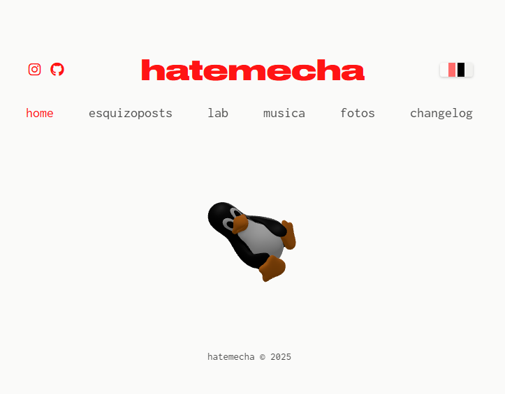

# porqueodiasamecha

## Introduccion
Siempre quise tener un sitio web pero nunca pude idearlo de una manera que en serio se sienta mio. Con ayuda de el conocimiento que tengo en desarrollo web y algunas IA's logre hacer algo exactamente como lo imaginaba. No le di muchas vueltas y el resultado es este.

## Caracteristicas
- Home: Acá tengo un modelo 3D que cambia aleatoriamente.
- Esquizoposting: Acá tengo algunos de mis dibujos, notas y cosas que me atreva a compartir.
- Lab: Acá tengo algunos de los proyectos en los que estoy trabajando. Intento explicarlos lo mejor posible para que cualquiera pueda entenderlo.
- Musica: Mi musica, no mucho más.
- Fotos: Galeria de fotos que he sacado. 

## Tecnologías

- HTML5
- CSS3 (variables CSS para temas)
- JavaScript (ES6+)
- Three.js para visualización 3D
- Font Awesome para iconos

## Modelos 3D

Los modelos 3D utilizados tienen las siguientes licencias:

- **Canon AT-1 Retro Camera**: CC-BY-4.0 por AleixoAlonso
- **Lenovo Thinkpad L410**: CC-BY-4.0 por AquaEquinox
- **LINUX-CHAR**: CC-BY-NC-4.0 por Fundasoft

Ver archivos `license.txt` en cada carpeta de modelo para más detalles.

## Licencia

Este proyecto es un trabajo personal. Todos los derechos reservados sobre el contenido artístico y fotográfico.
